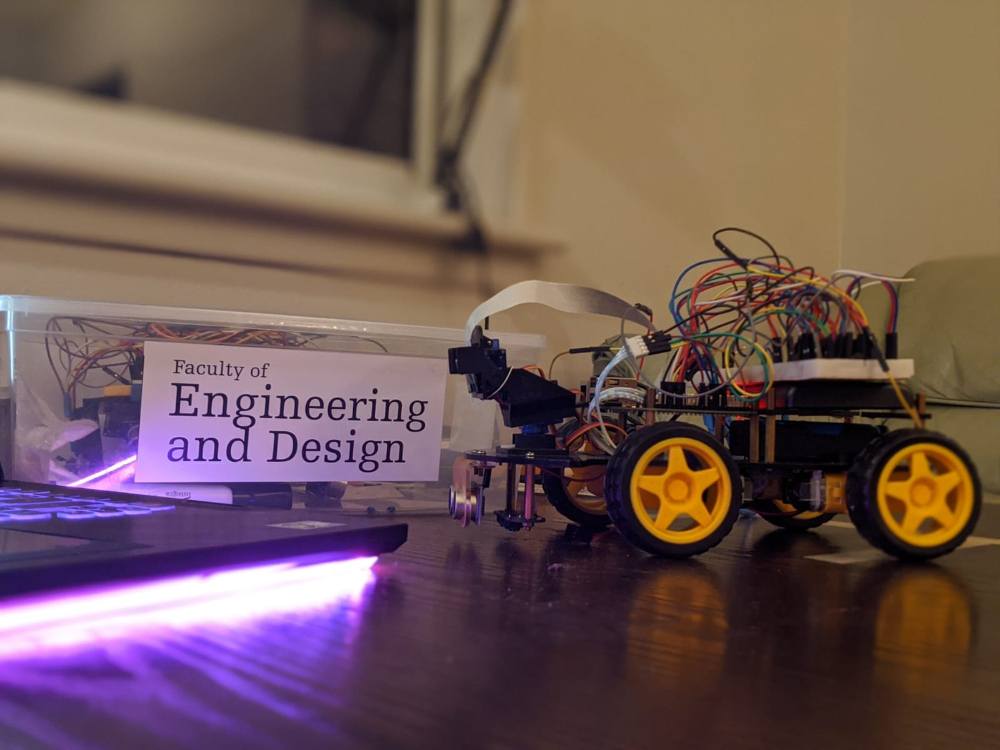

# SYSC 4907 Project - SCAR(Smart collision avoiding robotics)

Created (October 8th) - Due for Sunday, October 13th

General note - To make sure we are all on the same page, download openCV 4.1.1 (https://opencv.org/releases/). We are using python 3.7.
(https://www.anaconda.com/distribution/#download-section). This comes with a great platform known as jupyter notebook. We should code
here for modularizing and testing out code as we go (It's basically an IDE). We can then either share links or upload it here on Github. 

This project hopes to bring new transportation technology to help disabled students at Carleton University. The idea of the project was directed towards creating a modeled autonomous vehicle that followed a certain path indicated by "road lines" to guide the modeled car. The RC car is a piece of smart technology that also avoids obsticles if it appears in front of the car.

The code used can be viewed in the respective directories of this repository and a video of our presentation can be found on this link below (will need permission)
https://drive.google.com/open?id=1VRhcEXFqSbSOX8QJP-czHu4cwdHIN5BN

